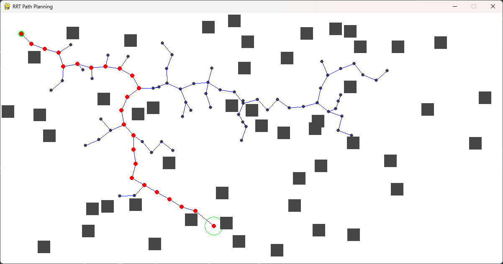

# RRT-Rapidly exploring-Random-Tree

## Introduction
RRT (Rapidly Exploring Random Tree) is a Python implementation of the RRT algorithm using Pygame for visualization. RRT is a popular algorithm in the field of motion planning and robotics, known for efficiently exploring the search space to find feasible paths from a starting point to a goal point amidst obstacles.

This repository contains two main files:

- `RRTbase.py`: Defines the RRTmap class responsible for visualizing the map and obstacles, and the RRTGraph class which implements the RRT algorithm.
- `RRT.py`: Implements the main logic of the RRT algorithm using the classes defined in RRTbase.py and provides visualization using Pygame.

## Features

- Interactive visualization of the RRT algorithm's exploration process.
- Randomized obstacle generation within the map.
- Dynamic adjustment of parameters such as map dimensions, start and goal positions, obstacle dimensions, and the number of obstacles.
- Path visualization from the start to the goal after the RRT algorithm finds a feasible path.



## Installation

1. Ensure you have Python installed on your system.
2. Clone this repository to your local machine: `git clone https://github.com/varun-ajith/RRT-Rapidly-Exploring-Random-Tree.git`
3. Navigate to the cloned directory: `cd RRT-Rapidly-Exploring-Random-Tree`
4. Install the required dependencies: `pip install pygame`

## Usage
1. Run the `RRT.py` file: ``` python RRT.py ```

2. Follow the instructions displayed in the Pygame window to interact with the RRT visualization:

  - Left-click to place the start and goal positions.
  - Watch as the RRT algorithm explores the map to find a feasible path.
  - Observe the final path displayed in red upon completion.
## Customization
You can customize various parameters of the RRT algorithm and visualization by modifying the following variables in `RRT.py`:

- `dimensions`: Tuple representing the dimensions of the map (height, width).
- `start`: Tuple representing the coordinates of the start position.
- `goal`: Tuple representing the coordinates of the goal position.
- `obsDim`: Integer representing the dimensions of obstacles.
- `obsNum`: Integer representing the number of obstacles.
- `iteration`: Integer representing the number of iterations for the RRT algorithm.
## Contributing
Contributions are welcome! If you have any suggestions, improvements, or feature requests, please feel free to open an issue or create a pull request.

## License
This project is licensed under the MIT License.
